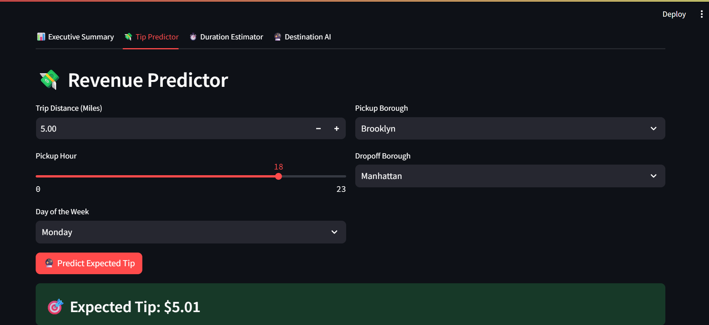
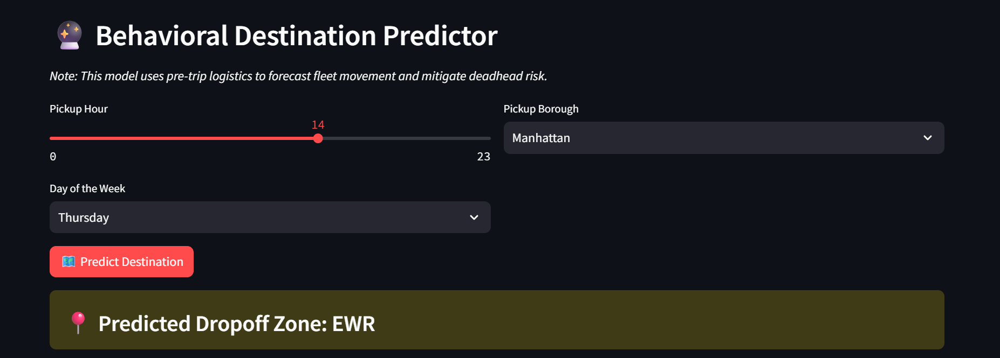

# 🚕 NYC Taxi Fleet Optimization Suite
**End-to-End Data Engineering & Machine Learning Dashboard**

## 📌 Table of Contents
- [Project Overview](#project-overview)
- [Business & Research Objectives](#business--research-objectives)
- [Data Sources](#data-sources)
- [Exploratory Data Analysis](#exploratory-data-analysis)
- [Models Used](#models-used)
- [Evaluation Metrics](#evaluation-metrics)
- [Application](#application)
- [Project Structure](#project-structure)
- [How to Run This Project](#how-to-run-this-project)
- [Author & Contact](#author--contact)

---

<h2 id="project-overview">🚀 Project Overview</h2>

This project implements a comprehensive **full-stack machine learning system** designed to modernize taxi fleet operations. Processing millions of raw municipal records, the suite provides fleet managers with predictive intelligence to optimize driver routing, forecast shift revenue, and predict complex urban traffic patterns via an interactive web application.

<h2 id="business--research-objectives">🎯 Business & Research Objectives</h2>

**1. Data Engineering: The Foundation Pipeline** * **Business Problem:** Raw municipal data contains millions of unverified records with impossible physical events (e.g., negative time durations, "time travel") and financial distortions (unrecorded cash tips). Standard Python libraries cannot process these massive files out-of-memory.
* **Research Objective:** Build a robust, memory-efficient SQL pipeline using DuckDB to filter anomalies, synthesize derived time/distance features, and isolate a pristine dataset of valid credit card transactions, strictly preventing downstream Data Leakage.

**2. Revenue Predictor: Optimizing Hourly Yield** * **Business Problem:** Drivers experience highly variable hourly wages due to poor route selection and "blind" dispatching. Tip amounts exhibit severe heteroskedasticity (variance scales exponentially with distance).
* **Research Objective:** Predict expected gratuity strictly based on pre-trip logistics (time, day, starting/ending borough) without utilizing post-trip financial data. Utilize advanced non-linear regression algorithms to accurately map human tipping behavior.



**3. Traffic & Duration Estimator: Dynamic Routing** * **Business Problem:** In New York City, physical distance does not equal time. A 2-mile trip during rush hour takes drastically longer than at 3:00 AM, disrupting ETA systems and shift planning.
* **Research Objective:** Map the physical realities of city traffic to accurately predict trip duration in exact minutes. The model must isolate spatial-temporal penalties, such as the Evening Rush, to forecast travel time within a strict 4-minute margin of error.

**4. Behavioral Destination AI: Mitigating Deadhead Risk** * **Business Problem:** Dispatchers risk "deadheading"—sending drivers to remote outer-borough zones where they are highly unlikely to find a return fare.
* **Research Objective:** Classify a passenger's intended drop-off borough based strictly on pickup context. Address the massive "Manhattan Imbalance" (where >85% of trips remain inside Manhattan) using SMOTE to force the model to identify subtle outer-borough commuter patterns.



<h2 id="data-sources">🗄️ Data Sources</h2>

Data is extracted from the official **NYC Taxi and Limousine Commission (TLC) Trip Record Data**.
* **Format:** High-density `.parquet` files.
* **Scale:** Millions of rows processed via `DuckDB` SQL queries.
* **Features:** Pick-up/drop-off datetime, passenger count, trip distance, RateCode, Payment Type, and exact geographic Borough IDs.

<h2 id="exploratory-data-analysis">🔍 Exploratory Data Analysis</h2>

Key econometric and statistical findings during EDA:
* **The "Fan Effect" (Heteroskedasticity):** Scatter plots revealed tipping variance spreads massively as trip distance increases past 10 miles, rendering simple Ordinary Least Squares (OLS) Linear Regression ineffective.
* **The Data Leakage Trap:** High correlations between `fare_amount` and `tip_amount` were identified, but explicitly dropped from the feature set to ensure predictions rely *only* on pre-trip data known to the dispatcher.
* **Geographic Tipping Edges:** Trips originating in the outer boroughs (Brooklyn/Queens) demonstrated distinct profitability signatures compared to intra-Manhattan hops.

<h2 id="models-used">⚙️ Models Used</h2>

The pipeline leverages **Scikit-Learn** and **XGBoost** for modeling and preprocessing:
1. **Regression (Revenue & Duration):** * Linear Regression (Baseline - discarded due to homoskedasticity assumptions)
   * Random Forest Regressor
   * **XGBoost Regressor (Final):** Selected for its ability to handle non-linear traffic physics and high-variance spending behaviors.
2. **Classification (Behavioral Destination):**
   * **Random Forest Classifier:** Utilized to predict multi-class categorical boroughs.
3. **Data Balancing:**
   * **SMOTE (Synthetic Minority Over-sampling Technique):** Applied to the training data to synthetically generate outer-borough trips, forcing the AI to recognize minority classes despite the overwhelming Manhattan baseline volume.

<h2 id="evaluation-metrics">📊 Evaluation Metrics</h2>

* **Regression Models (Tip & Duration):** Evaluated using **Mean Absolute Error (MAE)** to provide interpretable real-world business error margins (Dollars and Minutes), alongside **R² Score** for variance explanation.
* **Classification Model (Destination):** Evaluated using **Accuracy, Precision, Recall, and F1-Score**. The detailed classification report was critical in exposing the model's reliance on majority-class odds prior to SMOTE implementation.

<h2 id="application">🌐 Application</h2>

The project includes a fully interactive, multi-tabbed **Streamlit Web Application** for fleet dispatchers. Users can seamlessly toggle between three inference modules:
* **Tip Predictor:** Input logistics to forecast expected shift profitability.
* **Duration Estimator:** Dynamically adjust the "Pickup Hour" slider to watch the algorithm account for rush hour traffic delays.
* **Destination AI:** Predict where a passenger is heading to strategically "chain" rides and maintain high fleet utilization.

<h2 id="project-structure">📁 Project Structure</h2>

```text
├── data/
│   └── sample_data.parquet           # Lightweight data sample for Github
├── images/
│   ├── tip_prediction_dashboard.jpg  # App screenshot
│   └── destination_prediction.jpg    # App screenshot
├── models/
│   ├── taxi_tip_model.pkl            # Trained XGBoost Revenue Model
│   ├── model_columns.pkl             # Encoded feature structure
│   ├── duration_model.pkl            # Trained XGBoost Traffic Model
│   ├── duration_columns.pkl
│   ├── destination_model.pkl         # Trained Random Forest Classifier
│   └── destination_columns.pkl
├── notebooks/
│   ├── 01_Data_Engineering.ipynb
│   ├── 02_Exploratory_Data_Analysis.ipynb
│   ├── 03_Machine_Learning_Tip_Predictor.ipynb
│   ├── 04_Machine_Learning_Duration_Estimator.ipynb
│   └── 05_Machine_Learning_Destination_Predictor.ipynb
├── .gitignore                        # Prevents massive data file uploads
├── app.py                            # Streamlit User Interface & Inference Engine
├── requirements.txt                  # Python dependencies
└── README.md

```

## 💻 How to Run This Project

1. **Clone the repository** to your local machine:
   ```bash
   git clone [https://github.com/YourUsername/nyc-taxi-fleet-optimization-ml.git](https://github.com/YourUsername/nyc-taxi-fleet-optimization-ml.git)
2. Navigate into the project directory:
cd nyc-taxi-fleet-optimization-ml
3. Install the required Python dependencies:
pip install -r requirements.txt
4. Launch the Streamlit dashboard
streamlit run app.py

<h2 id="author-contact">📁 Author Contact</h2>

**Ahmad Reza**  
*Aspiring Data Analyst – ML*  

- 📧 Email: ahmadreza6122@gmail.com  
- 🔗 LinkedIn: [[www.linkedin.com/in/ahmad-reza-econ](https://www.linkedin.com/in/ahmad-reza-econ)] 
- 🔗 GitHub:
